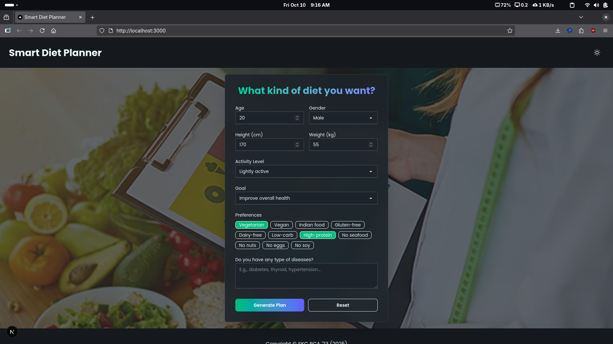
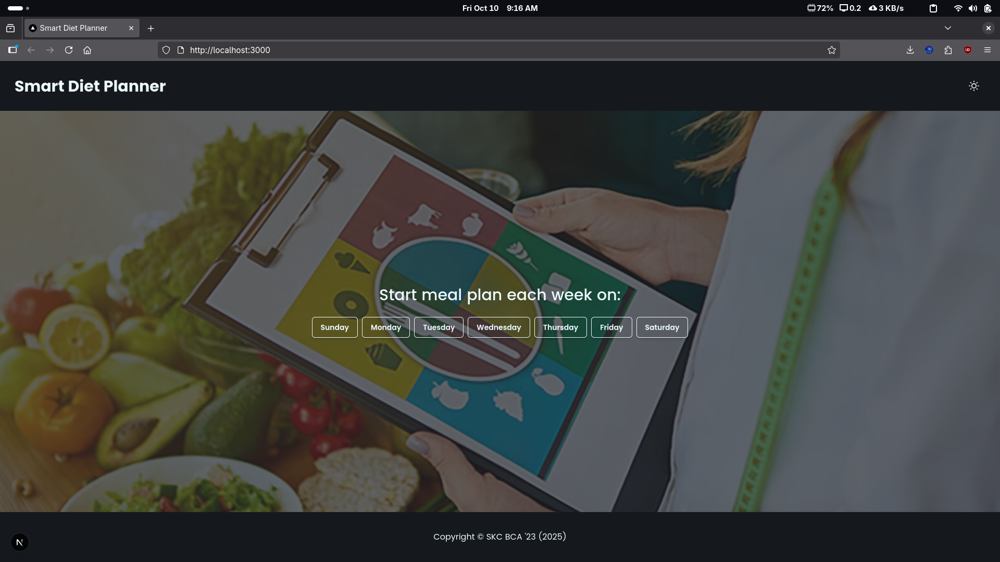
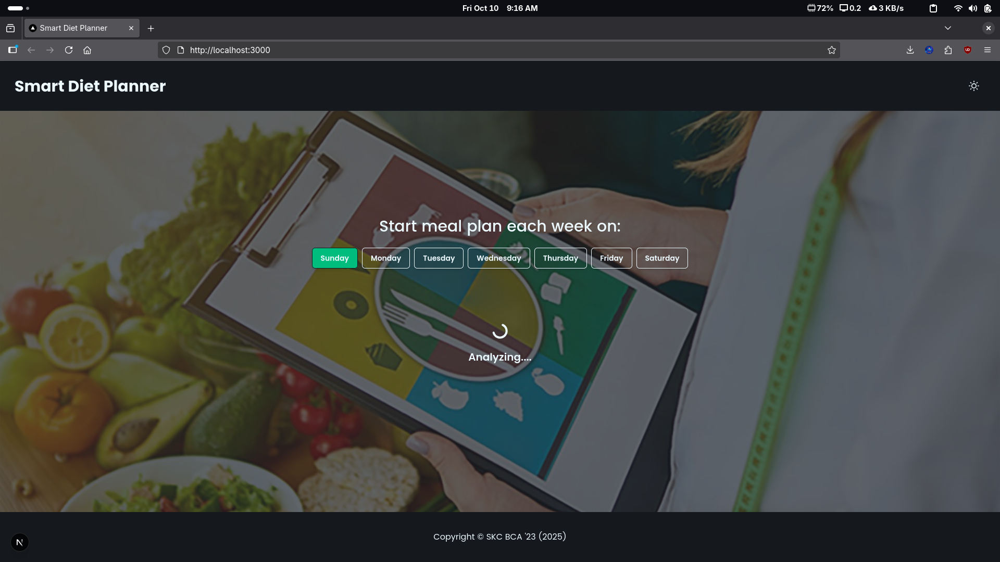
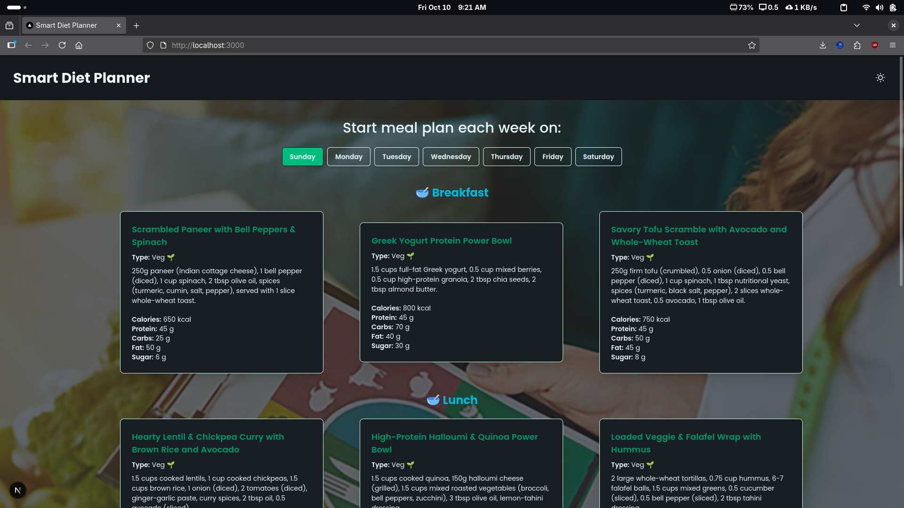
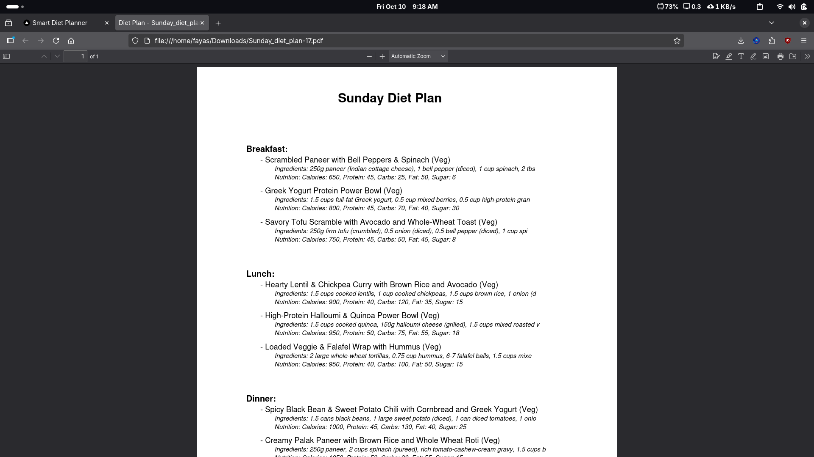

# Smart Diet Planner

Smart Diet Planner is an AI-powered application designed to help users create personalized diet plans based on their health goals, dietary preferences, and lifestyle.

---

## Features

- Personalized diet plans
- Nutritional analysis
- Meal suggestion
- Food preferences selection
- Responsive design
- Great UI/UX design
- Cache mechanism in frontend for faster response

---

## Technologies Used

- Frontend: Next.js (React), Tailwind CSS
- Backend: Node.js, Express
- AI Integration: Gemini API

---

### Getting Started

Clone the repository and follow the setup instructions for both the backend and frontend.

```bash
git clone https://github.com/fayasnoushad/smart-diet-planner.git
cd smart-diet-planner
```

#### Backend

Follow the instructions in the [backend README](./backend/README.md) to set up the backend API.

#### Frontend

Follow the instructions in the [frontend README](./frontend/README.md) to set up the frontend application.

---

### Usage

Once both the backend and frontend are running, you can access the application at `http://localhost:3000`.

---

### Screenshots

<div align="center">
    
    
    
    
    
    
</div>

---
